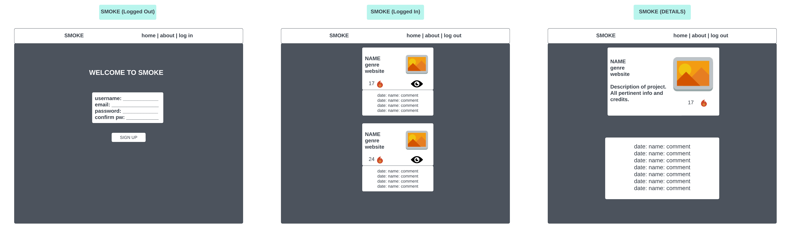
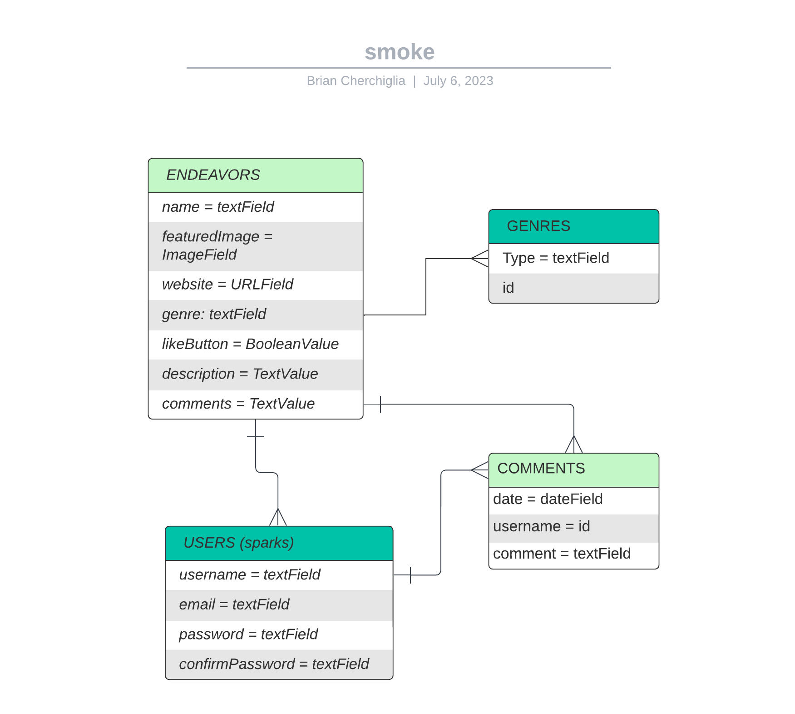

## **SMOKE**
#### _...where there's smoke, there's fire..._
***

#### Written by Brian Cherchiglia
#### Published by Cherch
#### Created on July 6, 2023
***
***
#### [**Github**](https://github.com/cherch173/smoke)
#### [**Trello**](https://trello.com/b/FAubJ0Vz)
***
***
### _**Description**_
We're fortunate to be surrounded by creativity. 

Everywhere we look (if we look closely enough) is an opporunity to spot a brief window for innovation, and with such marvels already within eyeshot -- wouldn't we be fools to look away?

Well, what if we _weren't_ looking away, but rather, were looking **directly** at it, but our ability to see it was obscured? What if there was just _too much_ clutter clouding our fields of vision?

Introducing: **SMOKE** -- a social network specifically centered around showcasing creative endeavors.

SMOKE allows its CREATIVES to post their CREATIONS (ranging from Art, Film, Music & Theater to Chemistry, Theses, Mathematics, Physics, Intellectual Property and more) and allows its USERS (aka SPARKS) to engage directly with it by leaving a COMMENT or, choosing to like the post.

By using detail functionality, we can initially showcase each creative endeavor in a social feed with truncated / redacted information (such as its image, link and name) allowing for a cleaner U/I experience where the user retains information both at the headline & detail levels.

***

***
### _**Concept**_
To build **SMOKE** we'll be using the MERN Stack (MongoDB, Express.js, React, Node,js).

The BACKEND of the site will be built with several components.  We'll use **NODE.js** to manage our server-side relations, while **Express.js** will provide our framework.  The DATA will be stored and managed in **MongoDB**.

The FRONTEND will be constructed primarily using **REACT**, utilitizing hooks such as useState, useEffect and more to transform an existing App.jsx file to import the PROPS of several different PAGES and COMPONENTS.

For **User Authorization** we'll be using React and Mongo's Built-In Authentication and JWT (JSON Web Tokens) to ensure privacy and user safety.

REGISTRATION (Sign Up), LOGGING IN and OUT will be handled using React FORMS using hooks such as useEffect and useState.
***
***
### _**Technologies**_
- MongoDB
- Express.js
- React
- Node.js
- JWT
- s3 / AWS
***
***
### _**Getting Started**_
As per **Cherch Games**' ethos, simplicity is key to a smooth user experience.

We'll have FOUR MODELS, all which interact with eachother.

**ENDEAVORS**
- **name:** TextField
- **featuredImage:** ImageField
- **genre:** linked by ID [build as array, max 3]
- **website:** URLField (max 1 to prevent clutter)
- **likeButton:** BooleanValue (branded as **FIRE**)
- **comments:** linked by ID
- **detailsButton:**

This model will have full CRUD capabilities.

**GENRES (Many to Many)**
- **type:** TextField [_Art, Animation, App, Blog, Book, Chemistry, Experiment, Film, Gaming, Invention, Intellectual Property, Music, Musical Theater, Play, Poetry, Program, Physics, Science, Short, Stand-Up, Thesis, Theory, Video Game, Website, or Other_]

**USERS (aka SPARKS)**
- username = textField
- email = textField
- password = textField
- confirmPassword = textField

**COMMENTS**
- date = dateField
- username = textField
- comment = textField
***
***
## _**WIREFRAME**_

***
***
## _**ERD**_

***
***
## _**COMPONENT HEIRARCHY DIAGRAM**_

***
***
## _**PROJECT FLOW**_
- **THURSDAY 07.06.2023**
    - [X] Project Conceptualization
    - [X] Draft and compose ReadME
    - [X] Concept Approval
    - [X] Make and import ERD
    - [X] Make and import Wireframe
    - [X] Final Revision of ReadME
    - [X] Trello Board
    - [X] touch .env and .gitIgnore
- **FRIDAY 07.07.2023**
    - [X] Project Approval
    - [X] Use vite@create to generate React Framework
    - [X] Install dependencies
    - [X] Install Mongoose
    - [X] Install Axios
    - [X] Express Generate BackEnd Framework
    - [X] Compose server.js
    - [X] Make all directories (M, V, C, DB, MW) 
    - [X] Compose index.js inside Express DB
    - [X] Enter Mongo DB DATABASE_URI into .env
    - [X] Add node --watch server.js to package.json to activate npm run dev
    - [X] Succesfully connect to Express Server (Backend)
    - [X] Successfully connect to Vite Server (Frontend)
    - [X] Connect to Database and Verify with MongoDB
    - [X] Build Model for ENDEAVOR, GENRES & COMMENTS
    - [X] Build index.js for Model
    - [X] Build out Controller for ENDEAVOR
    - [X] Route ENDEAVOR
    - [X] Add new ENDEAVOR to DATABASE using Insomnia
    - [X] Controller for Genres
    - [X] Router for Genres
    - [X] Successfully Add all Genres within enum Paramrters with Insomnia
    - [X] Controller for Comments
    - [X] Router for Comments
    - [X] Begin AUTH on Backend and create User Model
    - [X] Build out AuthController
    - [X] Build out Middleware
- **SATURDAY 07.08.2023**
    - [X] Route AUTHRouter
    - [X] Add Tokens to existing Routes
- **SUNDAY 07.09.2023**
    - [X] Create USER Model in Backend
    - [X] Verify USER Data being sent to MongoDB
- **MONDAY 07.10.2023**
    - [X] UPDATE / DELETE Functionality of ENDEAVOR (M, V, C)
    - [X] Test ENDEAVOR UPDATE / DELETE with Insomnia
    - [X] UPDATE / DELETE for GENRE (M, V, C)
    - [X] Test GENRE UPDATE / DELETE with Insomnia 
    - [X] UPDATE / DELETE for COMMENT (M, V, C)
    - [X] Test COMMENT UPDATE / DELETE with Insomnia 
    - [X] Begin Frontend Construction starting at the Top
    - [X] IMPORT BrowserRouter to Main.jsx
    - [X] Create HOME.jsx Page
    - [X] Create NAV Bar Component
    - [X] Build NAV Bar Component
    - [X] Begin HOME Page design
    - [X] Create ABOUT Page
    - [X] Complete ABOUT Page
    - [X] Confirm Nav moves between ROOT & ABOUT Pages
    - [X] Build ENDEAVOR FEED.jsx w/ temp 
 of sup
    - [X] Add FEED Route (/endeavors) to NAV
    - [X] Test FEED interactivity
    - [X] mkdir SERVICES folder
    - [X] Build api.js in SERVICES
    - [X] Build EndeavorServices.js in SERVICES
    - [X] Build Auth.js in SERVICES
    - [X] Complete SERVICES
    - [X] Get DATA into FEED
    - [X] Test Data with Insomnia and MongoDB
    - [X] Add LIKE to Endeavor 
    - [X] LIKE Button functionality
    - [X] LIKE BUTTON IMG confirms onClick to add to count
- **TUESDAY 07.11.2023**
    - [X] DETAIL FUNCTIONALITY for ENDEAVOR -- i.e. EndeavorDetails
    - [X] Get GENRE Data to link with ENDEAVOR DATA in FEED
    - [X] Build ADD NEW Endeavor Form
    - [X] Build out REGISTER Page and add to App.jsx
    - [X] Build out the SIGN IN Page and add to App.jsx
    - [X] Confirm SIGN IN works with the only USER created on backend 
    - [X] Store the JWT 
    - [X] AUTH LINKS to NAV like SIGN UP / LOGIN / LOGOUT
    - [X] Confirm in MongoDB that NEW USERS can be CREATED 
    - [X] Update App.jsx to handle LOG IN & LOG OUT 
    - [X] Conditional Rendering for LOGGED IN vs LOGGED OUT in FEED
    - [X] Conditional Rendering for LOGGED IN vs LOGGED OUT in NAV
    - [X] Confirm LOG OUT works
- **WEDNESDAY 07.12.2023**
    - [X] Confirm ADD NEW Endeavor Form sends to Backend
    - [X] Successfully ADD NEW Endeavor
    - [X] Add a FOOTER
    - [X] Add CONTACT (mailto:) to FOOTER
    - [X] Build GetYear Functionality for Copyright
    - [X] Create Comment.jsx
    - [X] Route Comment.jsx into FEED (Endeavor)
    - [X] Refactor GENRES into Endeavor Schema
    - [X] Ensure that LIKE COUNT SAVES
    - [X] Make sure a USER can only LIKE a POST ONCE
    - [X] Get COMMENT Data to link with ENDEAVOR DATA in FEED
- **THURSDAY 07.13.2023**
    - [] Build ADD COMMENT Backend Functionality
    - [] Construct the ADD COMMENT FORM inside the COMMENT TABLE
    - [] Confirm STATE updates of NEW COMMENT
    - [] Confirm COMMENT Data being sent to MongoDB
    - [] Connect ADD COMMENT Backend to Frontend
    - [] Finish COMMENT Frontend Design
    - [] UPDATE / DELETE for ENDEAVOR 
    - [] UPDATE / DELETE for USER (M V C)
    - [] Test USER UPDATE / DELETE with Insomnia
    - [] MVP
    - [] ADD CSS Styling
    - [] Debug
- **FRIDAY 07.14.2023**
    - []
    - []
    - []
    - []
    - []
- **SATURDAY 07.15.2023**
    - []
    - []
    - []
    - []
    - []
- **SUNDAY 07.16.2023**
    - []
    - []
    - []
    - []
    - []
- **MONDAY 07.17.2023**
    - []
    - []
    - []
    - []
    - []
- **TUESDAY 07.18.2023**
    - []
    - []
    - []
    - []
    - []
- **WEDNESDAY 07.19.2023**
    - [] Debug
    - [] Final Tests
    - [] Deploy

***
***

***
***
### _**Credits**_
##### **IMAGES USED**
##### Smoke Gif -- [Tenor](https://media.tenor.com/anXw_NzGr8EAAAAC/smoke.gif)
##### Twin Peaks Gif -- [Showtime](https://media.tenor.com/87hMoRvfqRQAAAAC/twin-peaks-twin-peaks-the-return.gif)
##### Akira Gif -- [GfyCat](https://thumbs.gfycat.com/HelplessSoftHeron-max-1mb.gif)